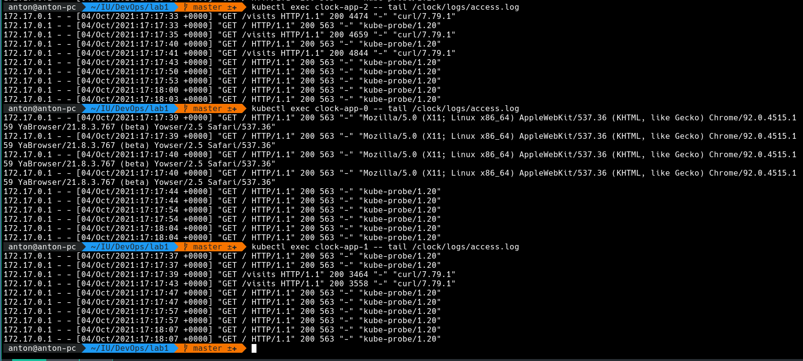

# StatefulSet

The difference in replica's output is caused by `LoadBalancer` service type.
The service tries to distribute requests equally, that's why we see different content in each file.

> For our app ordering guarantee are unnecessary. Describe in the report why

Our apps are running fully independently and do not communicate with each
other. That's why we don't need any specific ordering.

From
[StatefulSet docs](https://kubernetes.io/docs/concepts/workloads/controllers/statefulset/#pod-management-policies):
> Parallel pod management tells the StatefulSet controller to launch or terminate all Pods in parallel <...>
This is exactly what we want. However, we cannot update our StatefulSet to
make it update pods in parallel. We should recreate release.
