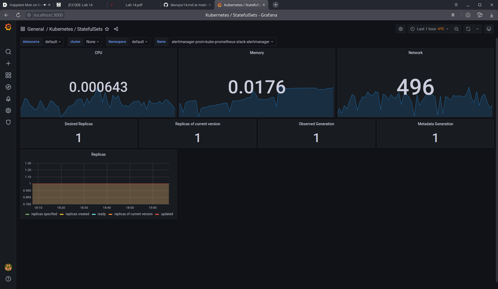
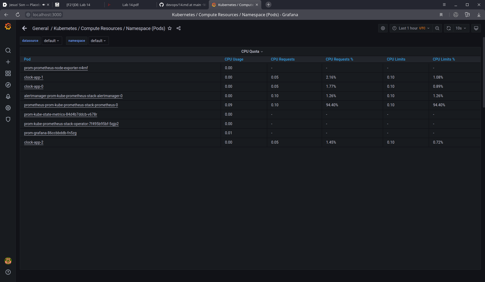
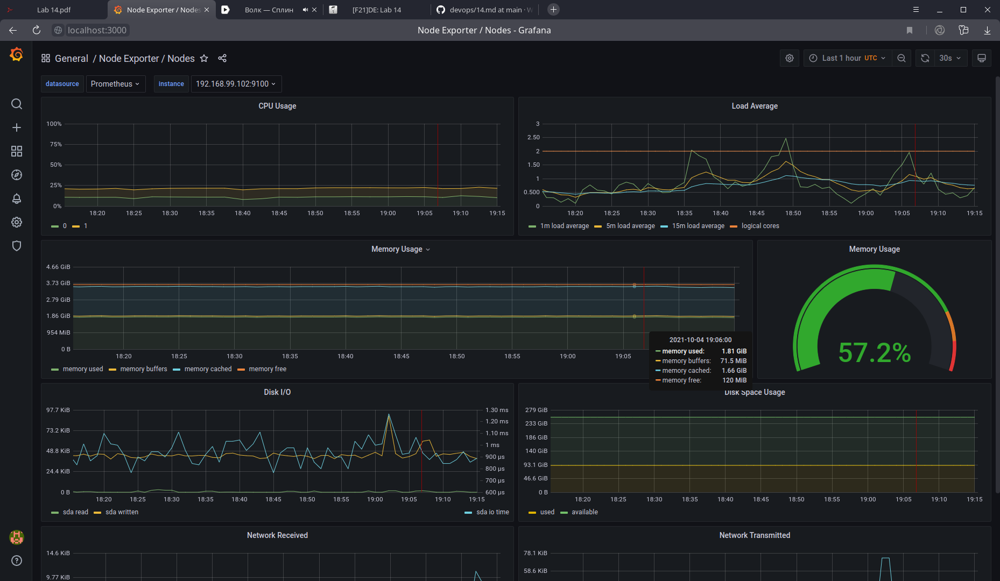
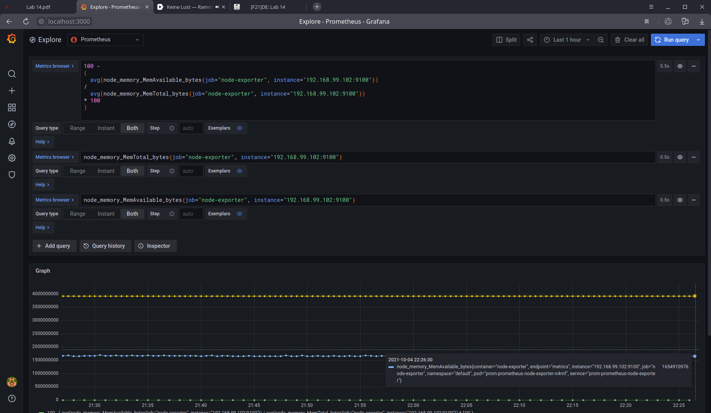
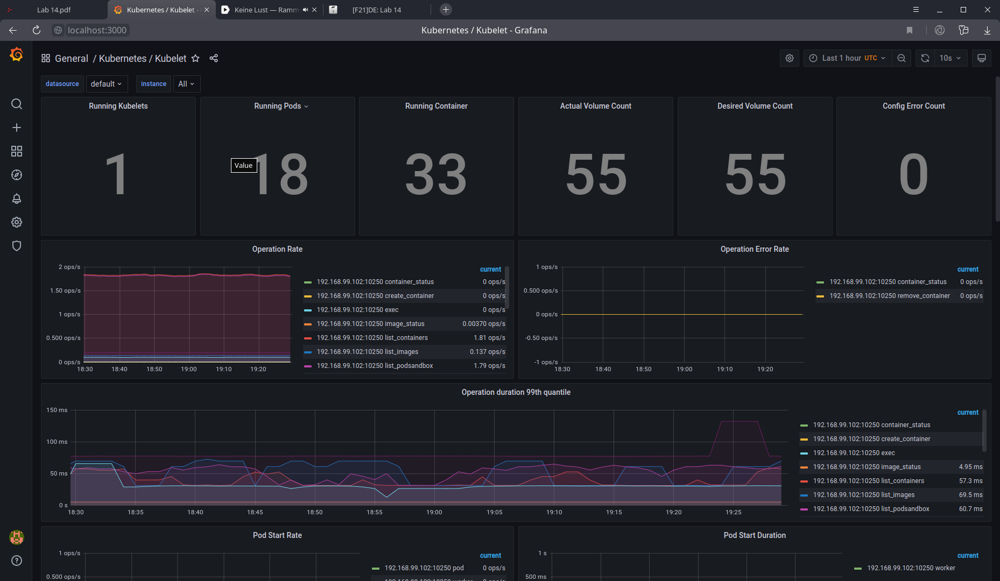
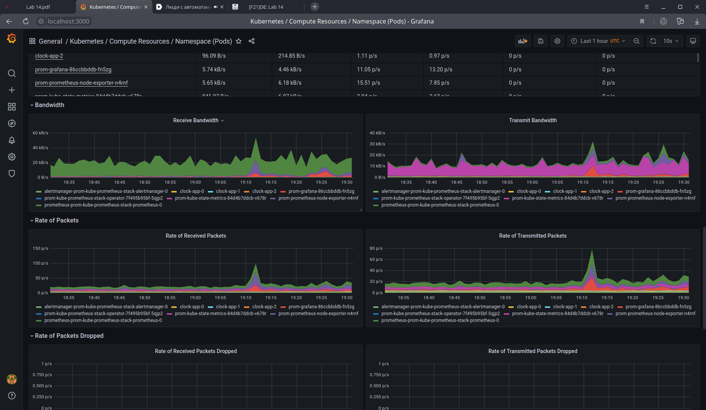
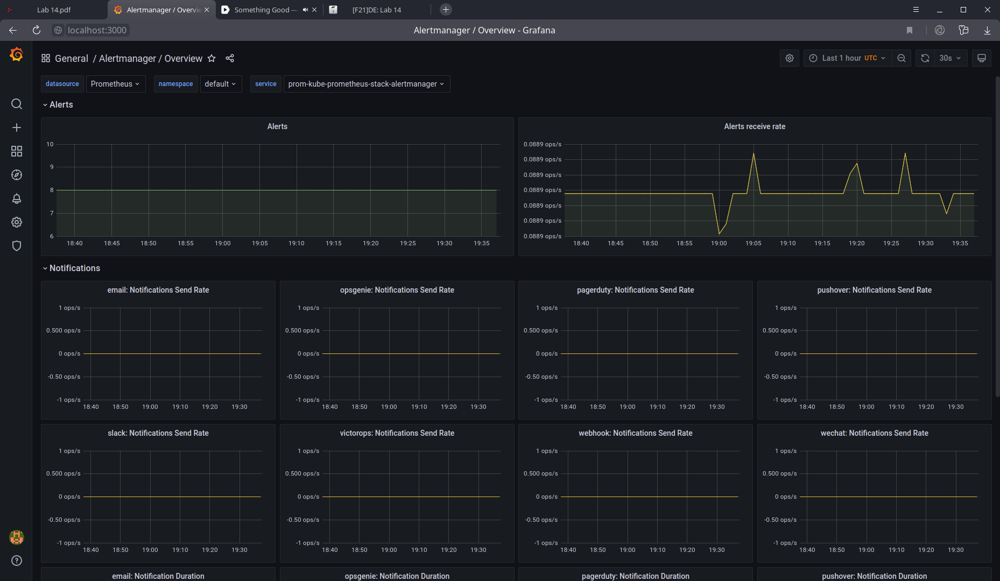

# Kube prometheus

## Kube prometheus stack components

* **Prometheus** time series database. Usually used to store metrics and
retrieve them with powerful query language.
* **node_exporter** is an agent that collects metrics from nodes, in our case pods.
* **Grafana** software that can build beautiful plots and dashboards provided with data.
* **Alertmanager** software that can create and deliver alert notifications from Prometheus data.
* **Kube-state-metrics** gather metrics from Kubernetes cluster.
* **Prometheus Adapter for Kubernetes Metrics APIs** Not sure about this.
    Seemingly it just connects together prometheus and Kube-state-metrics.
* **Prometheus-operator** Allows configuring Prometheus via native way for Kubernetes: declarative yml files.

The command prints all Kubernetes object of types: `pod`, `statefulset`, `service`, `persistentvolumeclaim`, `configmap`.

When the chart was installed, one can use `kubectl port-forward [pod] 3000`,
as described
[here](https://github.com/prometheus-operator/kube-prometheus#access-the-dashboards).

1. StatefulSet consumes 0.0176 Gb of memory and <1% of CPU

2. It is hard to say which pod uses least CPU, but it is clearly visible that
prometheus pod uses the most

3. Around 60% of RAM is used in node, namely 1.65Gb is available out of 3.9 total.

4. 18 pods and 33 containers are run by kubelet

5. Prometheus uses network the most, and clock-apps the least

6. I got 8 alerts
