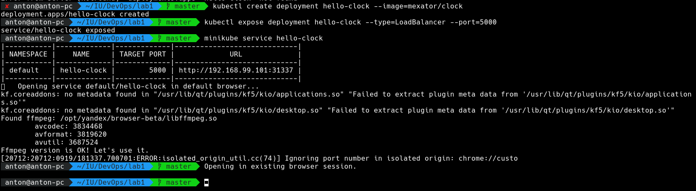
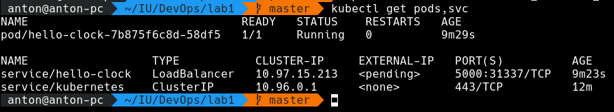
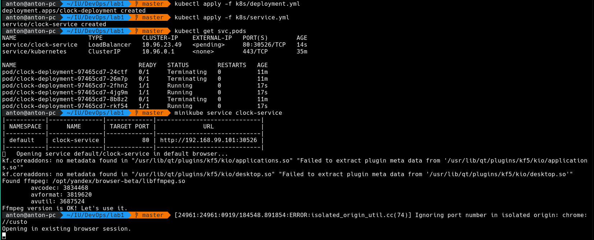

# Kubernetes

## Minikube

At first I tried to run minikube on Docker on my Manjaro machine, but pods
were unable to pull images from registry. Then I switched to VirtualBox driver
which fixed the issue.

The deploy creation process is presented below.

Output of `kubectl get pods,svc` command:

Output of `kubectl get pods,svc` command after migrating to deployment files:

