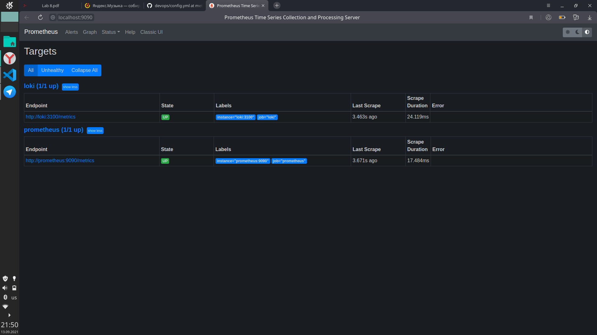

# Logging

## Best practices

1. Don't reinvent the wheel, don't use print. Most systems already
have some tooling for logs.
1. Use logging levels to easier filtering of your logs
1. Write Meaningful Log Messages
1. Add Context to Your Log Messages
1. Perform log rotation: compress & remove logs. Also backup logs

## Grafana screenshots

